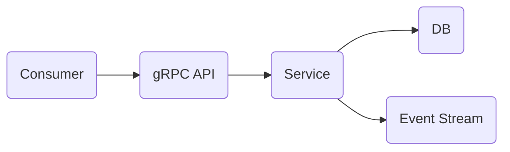

# EDA Fun

This is a repo to play around with building a microservice with an event driven approach.
Here is the breakdown:

# Stack
- Rust
- gRPC (Tonic)
- Postgres (AWS RDS instance)
- Diesel (ORM)
- Kafka (Confluent Cloud Event Sourcing)
- Terraform (Provisioning the DB)

# Architecture
