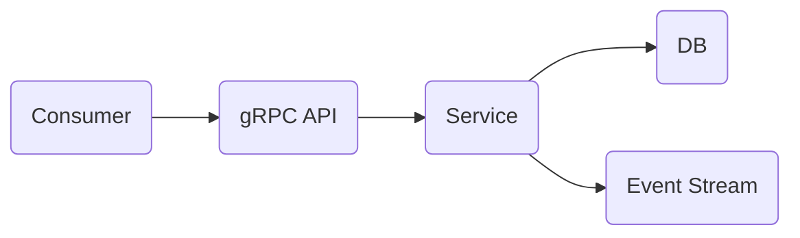

# EDA Fun

This is a repo to play around with building a simple stateful microservice with an event driven approach.
Here is the breakdown:

# Stack
- `Rust`: Main language for the project.
- `gRPC`: Transport layer protocol using the Tonic library. Testing via Postman.
- `Postgres`: Main database for the microservice hosted on an AWS RDS instance.
- `Diesel`: ORM and database migration management.
- `Kafka`: Event topics hosted on Confluent Cloud.
- `Terraform Cloud`: Provisionning the database instance with a GitOps flow.

# Architecture

# Repo Stats
|Language|Files|Lines|Blank|Comment|Code|
|---|---|---|---|---|---|
|Rust|21|562|80|17|465|
|Protobuf|1|58|10|0|48|
|Terraform|2|45|5|0|40|
|SQL|4|51|6|19|26|
|Toml|2|33|5|2|26|
|Markdown|1|27|4|0|23|
|Makefile|1|2|0|0|2|
|Total|32|778|110|38|630|